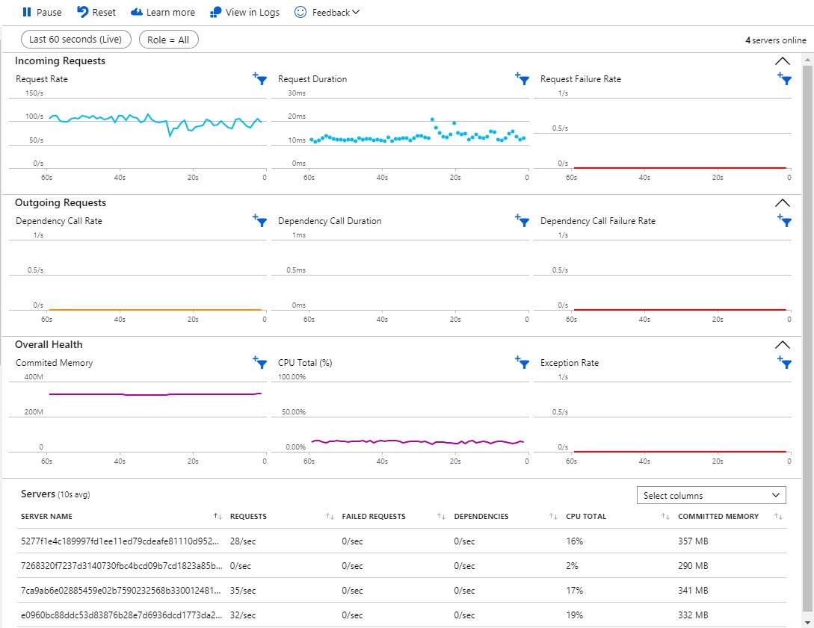
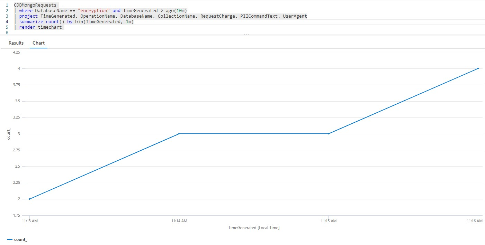
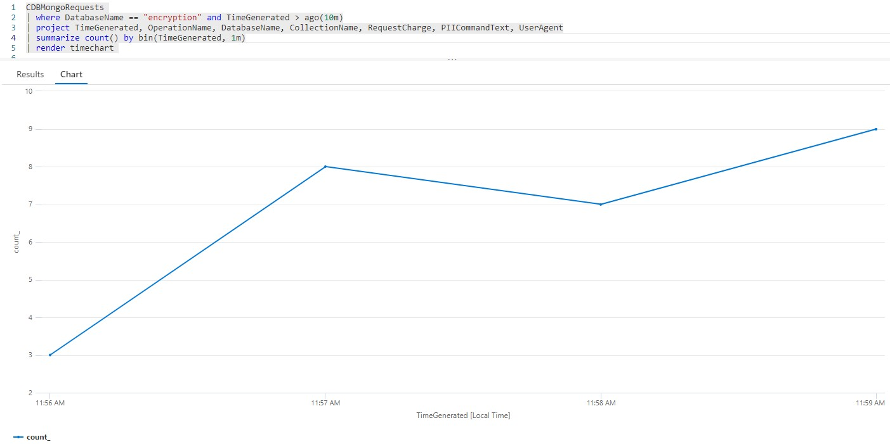
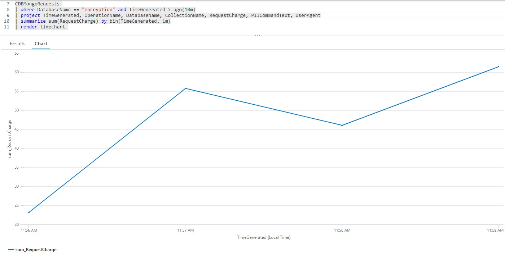

## Execution statistics

Since `keys` collection and Key Vault are accessed based on the workload, below we have some load test statistics to help sizing correctly your collection and perhaps cost estimation.

Load testing tool: <a href="https://docs.microsoft.com/en-us/azure/load-testing/" target="_blank">Azure Load Testing</a>

```
Test Environment:

Function -> Elastic Premium Plan EP1 (1 vCore)
Cosmos DB Mongo API:
    Orders collection: Auto scale 20,000 RU/s Max
    Keys collection  : Auto scale 4,000 RU/s Max
```

### Scenario 1: 100 simultaneous requests

**Create order API**

1. Function execution

   

1. Load Test statistics

   

1. Cosmos `keys` collections queries per minute

   

1. Cosmos `keys` collections Request Charge per minute

   

1. Key Vault hits

   

<br/>

**Get order API by Customer Id with Auto Decrypt**

1. Function execution

   

1. Load Test statistics

   

1. Cosmos `keys` collections queries per minute

   

1. Cosmos `keys` collections Request Charge per minute

   

1. Key Vault hits

   

<br/>

### Scenario 2: 250 simultaneous requests

**Create order API**

1. Function execution

   

1. Load Test statistics

   

1. Cosmos `keys` collections queries per minute

   

1. Cosmos `keys` collections Request Charge per minute

   

1. Key Vault hits

   

<br/>

**Get order API by Customer Id with Auto Decrypt**

1. Function execution

   

1. Load Test statistics

   

1. Cosmos `keys` collections queries per minute

   

1. Cosmos `keys` collections Request Charge per minute

   

1. Key Vault hits

   