# Cosmos Mongo API Client Encryption

## Introduction

This repository provides a code sample in .NET and Java on how to use MongoDB Client-Side Field Level Encryption with Azure Cosmos DB Mongo API 4.2 ([Supported features for version 4.2](https://docs.microsoft.com/en-us/azure/cosmos-db/mongodb/feature-support-42#client-side-field-level-encryption)).

### References

1. [MongoDB Explict Encryption](https://www.mongodb.com/docs/manual/core/csfle/fundamentals/manual-encryption/)
1. [MongoDB Automatic Decryption](https://www.mongodb.com/docs/manual/core/csfle/fundamentals/manual-encryption/#automatic-decryption)
1. [MongoDB Encryption Key Management](https://www.mongodb.com/docs/manual/core/csfle/fundamentals/manage-keys/)
1. [MongoDB Fields and Encryption Types](https://www.mongodb.com/docs/manual/core/csfle/fundamentals/encryption-algorithms/)
1. [MongoDB Use Automatic Client-Side Field Level Encryption with Azure](https://www.mongodb.com/docs/manual/core/csfle/tutorials/azure/azure-automatic/#std-label-csfle-tutorial-automatic-azure)


## Requirements

> It's recommended to create all the resources within the same region.

* <a href="https://docs.microsoft.com/en-us/azure/active-directory/develop/howto-create-service-principal-portal#register-an-application-with-azure-ad-and-create-a-service-principal" target="_blank">Create a service principal and secret.</a> Store TenantId, ClientId and the secret temporarely for next step reuse.

* <a href="https://docs.microsoft.com/en-us/azure/azure-functions/functions-create-function-app-portal#create-a-function-app" target="_blank">Create a Function App.</a> Choose the Runtime stack accordingly (sample code provided in **.NET 6** or **Java 11**).

* <a href="https://docs.microsoft.com/en-us/azure/key-vault/general/quick-create-portal" target="_blank">Create a Key Vault.</a>

* <a href="https://docs.microsoft.com/en-us/azure/cosmos-db/mongodb/quickstart-dotnet?tabs=azure-portal%2Cwindows#create-an-azure-cosmos-db-account" target="_blank">Create a Cosmos DB Mongo API account.</a>

* <a href="https://github.com/fonsecamar/cosmos-mongo-encryption.git" target="_blank">Clone this repository.</a>

## Configuration

* <a href="https://docs.microsoft.com/en-us/azure/app-service/overview-managed-identity?tabs=portal%2Chttp#add-a-system-assigned-identity" target="_blank">Enable system-assigned idenity on your Function App.</a>

* Configure Key Vault

    * <a href="https://docs.microsoft.com/en-us/azure/key-vault/general/assign-access-policy?tabs=azure-portal" target="_blank">Assign access policies</a>
        * Assign `Get, Create and Rotate` Key Permissions and `Get` Secret Permissions to your **Function Managed Identity**
        * Assign `Unwrap Key and Wrap Key` Key Permissions to your **service principal**
    * <a href="https://docs.microsoft.com/en-us/azure/key-vault/secrets/quick-create-portal#add-a-secret-to-key-vault" target="_blank">Create Secrets</a>
        * **encryptionPrincipalTenantId**: Service principal Tenant Id.
        * **encryptionPrincipalClientId**: Service principal Client/Application Id.
        * **encryptionPrincipalClientSecret**: Service principal Secret.
        * **mongoOrderConnectionString**: Primary Connection String of your Cosmos DB Mongo API (<a href="https://docs.microsoft.com/en-us/azure/cosmos-db/mongodb/connect-mongodb-account#get-the-mongodb-connection-string-to-customize" target="_blank">Get MongoDB connection string</a>).
        * **mongoVaultConnectionString**: Same value as **mongoOrderConnectionString**.

* <a href="https://docs.microsoft.com/en-us/azure/cosmos-db/mongodb/how-to-create-container-mongodb#portal-mongodb" target="_blank">Create a database and collections.</a>
    * Create `orders` collection: select `Sharded`, provide `customerId` as the **Shard key**, select `Autoscale` and provide `1000` as **Collection Max RU/s**.
    * Create `keys` collection: select `Unsharded`, select `Autoscale` and provide `1000` as **Collection Max RU/s**.

* <a href="https://docs.microsoft.com/en-us/azure/azure-functions/functions-how-to-use-azure-function-app-settings?tabs=portal" target="_blank">Configure application settings</a>
    * collectionName: `orders`
    * databaseName: `<database name>`
    * encryptionPrincipalTenantId: `@Microsoft.KeyVault(VaultName=<key vault name>;SecretName=encryptionPrincipalTenantId)`
    * encryptionPrincipalClientId: `@Microsoft.KeyVault(VaultName=<key vault name>;SecretName=encryptionPrincipalClientId)`
    * encryptionPrincipalClientSecret: `@Microsoft.KeyVault(VaultName=<key vault name>;SecretName=encryptionPrincipalClientSecret)`
    * mongoOrderConnectionString: `@Microsoft.KeyVault(VaultName=<key vault name>;SecretName=mongoOrderConnectionString)`
    * mongoVaultConnectionString: `@Microsoft.KeyVault(VaultName=<key vault name>;SecretName=mongoVaultConnectionString)`
    * mongoVaultNamespace: `<database name>.keys`
    * orderKeyName: `OrdersCMK`
    * vaultEndpoint: `<key vault name>.vault.azure.net` (do not include https://)

* Deploy Function application to Azure (<a href="https://docs.microsoft.com/en-us/azure/azure-functions/functions-develop-vs-code" target="_blank">Deploy using VS Code</a>).

## Running the sample

You can call Function APIs from Azure Portal or your favorite tool.

1. Call CreateKey function

    ```
    curl --request PUT 'https://<function app name>.azurewebsites.net/api/createkey/OrdersCMK?code=<function code>'
    ```
1. Check Key Vault Key and keys collection on Cosmos
    
    Cosmos DB key reference

    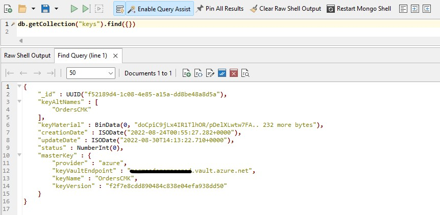

    Key Vault key reference

    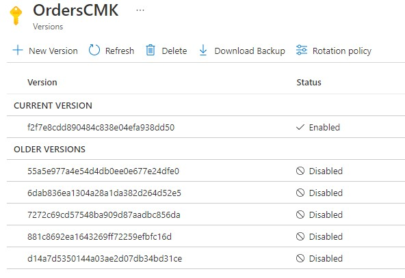

1. Call CreateOrder function

    ```
    curl --request POST 'https://<function app name>.azurewebsites.net/api/orders/create?code=<function code>' \
    --header 'Content-Type: application/json' \
    --data-raw '{
        "customerId": 1,
        "customerName": "John Doe",
        "shippingAddress": "John Doe's address",
        "amount": 200.00,
        "itens": 2
    }'
    ```
1. Call GetOrders function with different autoDecrypt values

    ```
    -- Returns Orders by CustomerId with Auto Decryption
    curl --request GET 'https://<function app name>.azurewebsites.net/api/orders?code=<function code>&customerId=1&autoDecrypt=true'

    -- Returns Orders by CustomerId without Auto Decryption
    curl --request GET 'https://<function app name>.azurewebsites.net/api/orders?code=<function code>&customerId=1&autoDecrypt=false'

    -- Returns Orders by CustomerName with Auto Decryption
    curl --request GET 'https://<function app name>.azurewebsites.net/api/orders?code=<function code>&customerName=John Doe&autoDecrypt=true'

    -- Returns Orders by CustomerName without Auto Decryption
    curl --request GET 'https://<function app name>.azurewebsites.net/api/orders?code=<function code>&customerName=John Doe&autoDecrypt=false'
    ```
1. Call RotateKey function

    ```
    curl --request PUT 'https://<function app name>.azurewebsites.net/api/rotatekey/OrdersCMK?code=<function code>'
    ```
1. Check new version of Key Vault Key and keys collection on Cosmos
    
    Cosmos DB key reference (new version)

    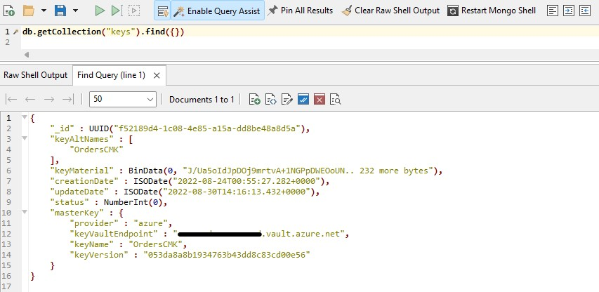

    Key Vault key reference (new version)

    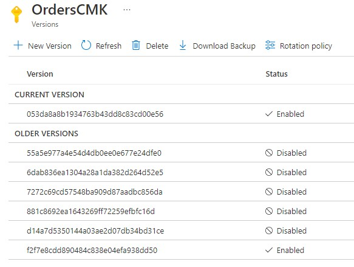

1. Call GetOrders function with different autoDecrypt values

    ```
    -- Returns Orders by CustomerId with Auto Decryption
    curl --request GET 'https://<function app name>.azurewebsites.net/api/orders?code=<function code>&customerId=1&autoDecrypt=true'

    -- Returns Orders by CustomerId without Auto Decryption
    curl --request GET 'https://<function app name>.azurewebsites.net/api/orders?code=<function code>&customerId=1&autoDecrypt=false'

    -- Returns Orders by CustomerName with Auto Decryption
    curl --request GET 'https://<function app name>.azurewebsites.net/api/orders?code=<function code>&customerName=John Doe&autoDecrypt=true'

    -- Returns Orders by CustomerName without Auto Decryption
    curl --request GET 'https://<function app name>.azurewebsites.net/api/orders?code=<function code>&customerName=John Doe&autoDecrypt=false'
    ```

## Execution statistics

Since `keys` collection and Key Vault are accessed based on the workload, below we have some load test statistics to help sizing correctly your collection and perhaps cost estimation.

Load testing tool: <a href="https://docs.microsoft.com/en-us/azure/load-testing/" target="_blank">Azure Load Testing</a>

```
Test Environment:

Function -> Elastic Premium Plan EP1 (1 vCore)
Cosmos DB Mongo API:
    Orders collection: Auto scale 20,000 RU/s Max
    Keys collection  : Auto scale 4,000 RU/s Max
```

### Scenario 1: 100 simultaneous requests

**Create order API**

1. Function execution

   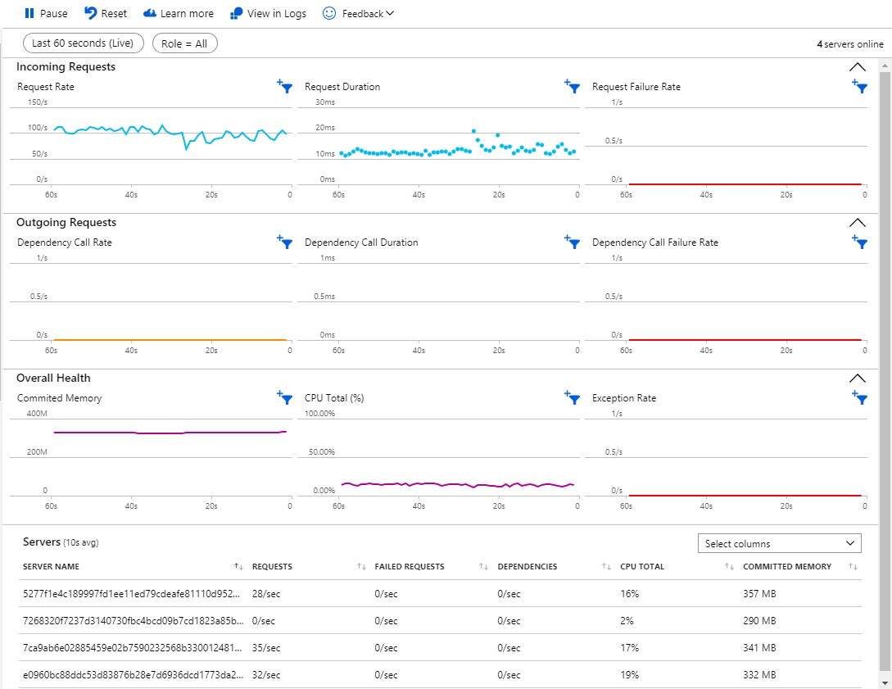

1. Load Test statistics

   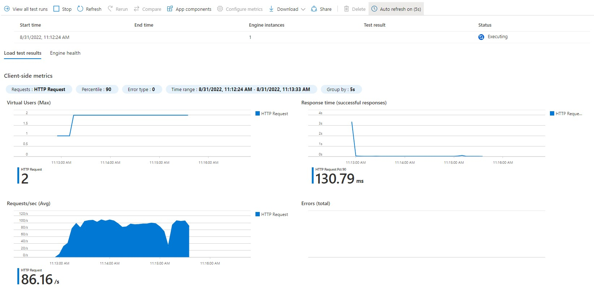

1. Cosmos `keys` collections queries per minute

   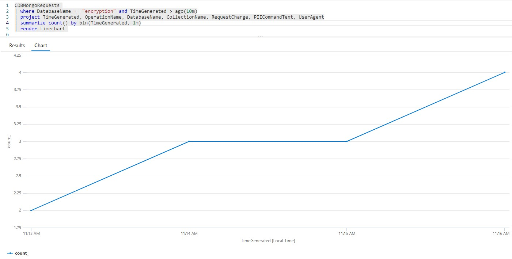

1. Cosmos `keys` collections Request Charge per minute

   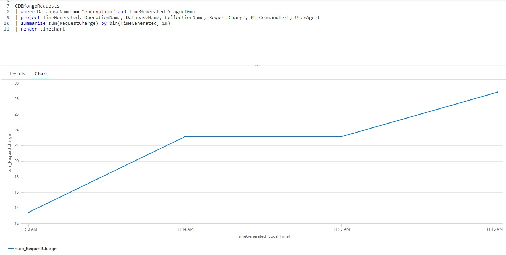

1. Key Vault hits

   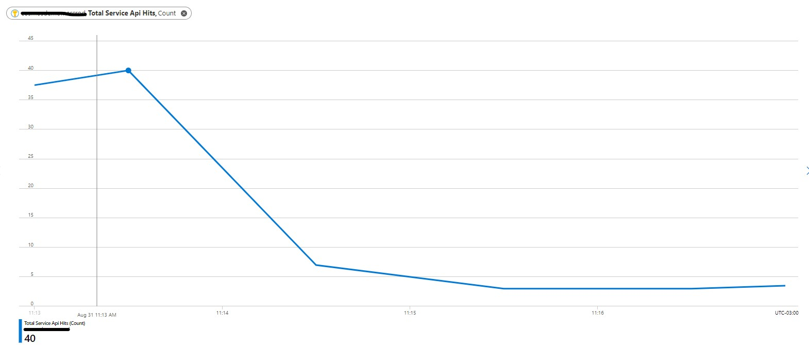

<br/>

### Scenario 2: 250 simultaneous requests

**Create order API**

1. Function execution

   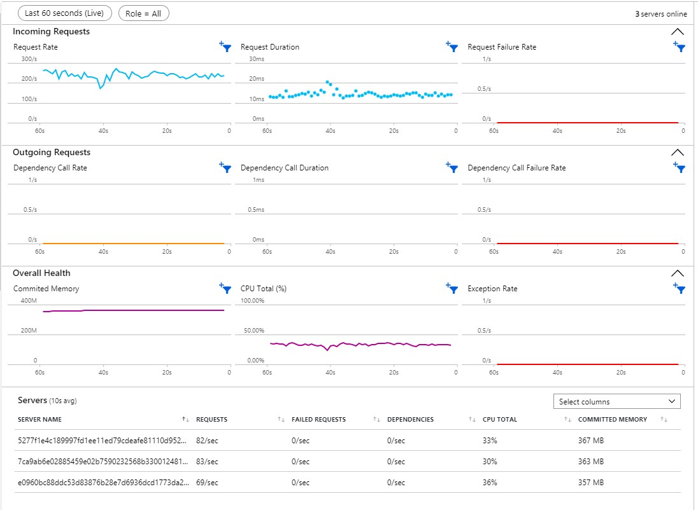

1. Load Test statistics

   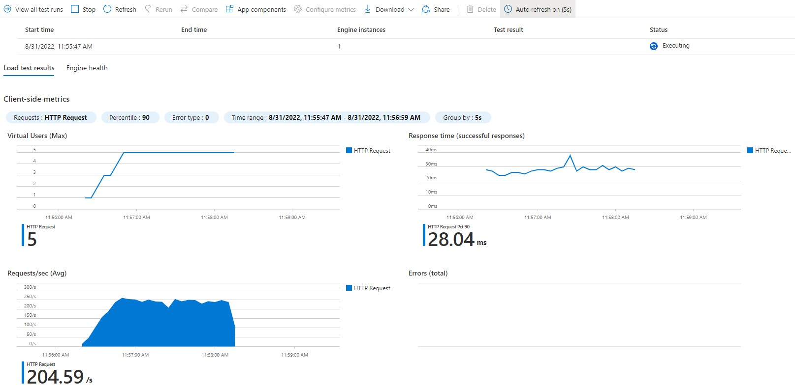

1. Cosmos `keys` collections queries per minute

   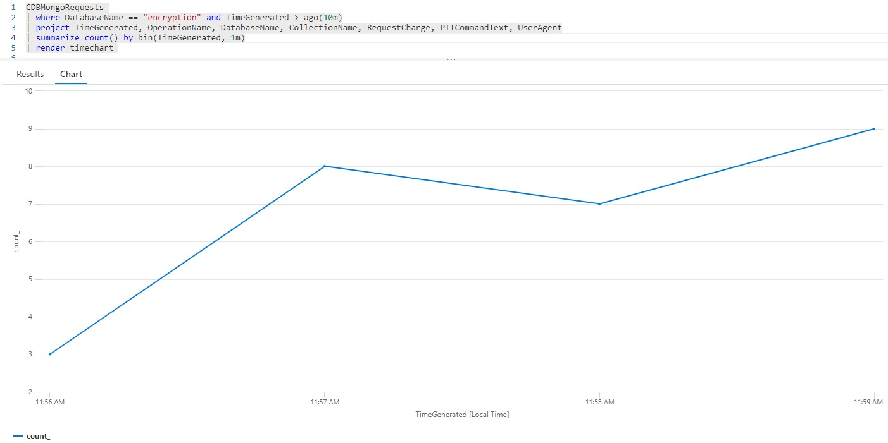

1. Cosmos `keys` collections Request Charge per minute

   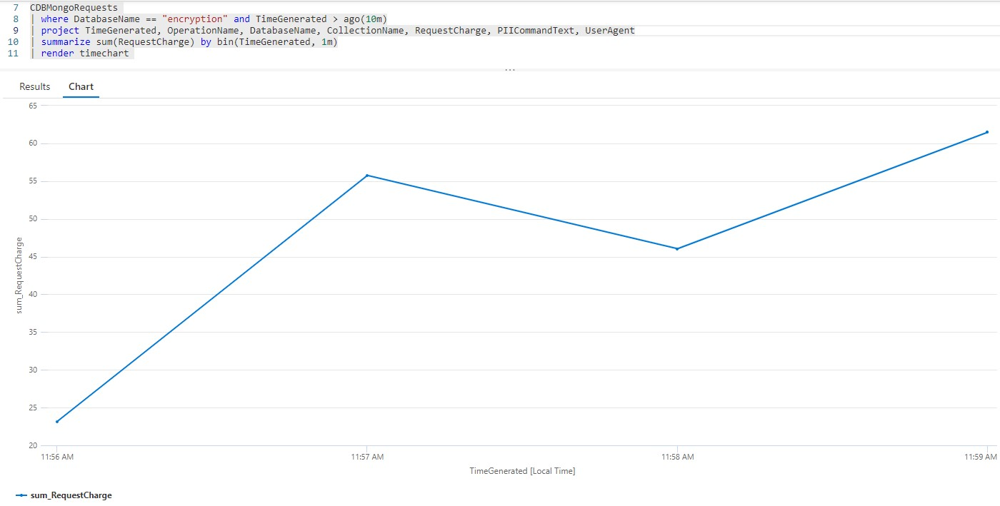

1. Key Vault hits

   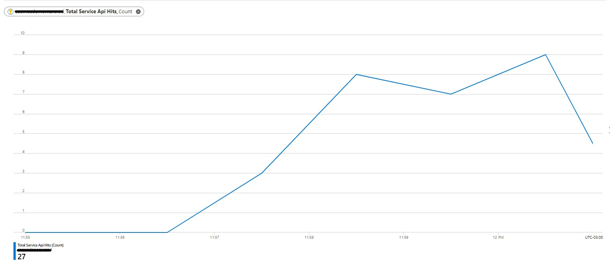
